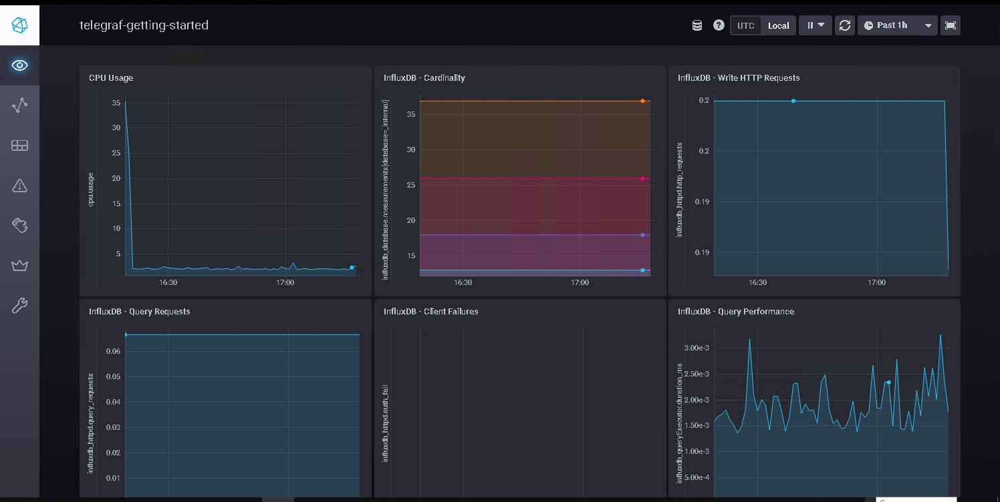
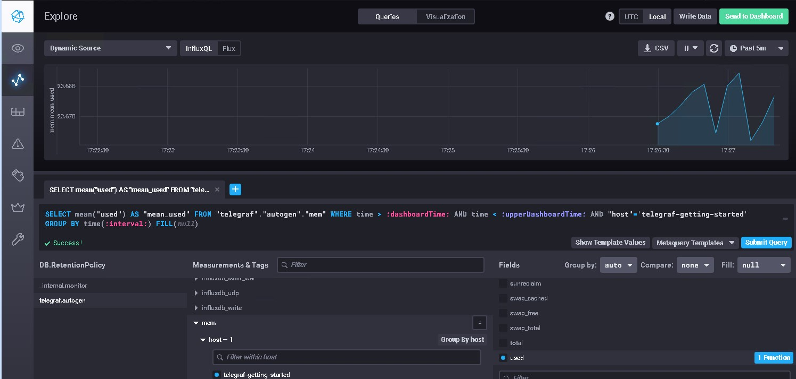

# Домашнее задание к занятию "13.Системы мониторинга"


## Обязательные задания

1. Вас пригласили настроить мониторинг на проект. На онбординге вам рассказали, что проект представляет из себя платформу для вычислений с выдачей текстовых отчётов, которые сохраняются на диск. 
Взаимодействие с платформой осуществляется по протоколу http. Также вам отметили, что вычисления загружают ЦПУ. Какой минимальный набор метрик вы выведите в мониторинг и почему?

**Ответ.**

- **Мониторинг OS**
  -	CPU:
    - CPU utilization
    - Load Average
  - RAM:
    - Memory utilization
    -	Free swap space in %
  -	DISK:
    -	Space utilization
    -	Free inodes in %
    -	Disk write request avg waiting time
    -	Disk read request avg waiting time
  -	NET:
    -	Загруженность интерфейсов (Bits received, Bits send) - на мой взгляд от этого можно отказаться в угоду производительности и оставить только (ping) 

- **Мониторинг App**:
  -	HTTP-запросы:
    - общее количество запросов
    -	количество ошибочных запросов
    -	время отклика


2. Менеджер продукта, посмотрев на ваши метрики, сказал, что ему непонятно, что такое RAM/inodes/CPUla. Также он сказал, что хочет понимать, насколько мы выполняем свои обязанности перед клиентами и какое качество обслуживания. Что вы можете ему предложить?

**Ответ.**

- **RAM** – оперативная память
-	**Inodes** - индексные дескрипторы. 
-	**CPU LA** - средняя нагрузка на процессор

Объясним менеджеру на его языке. Свяжем тех. метрики с бизнес-составляющей: SLO SLA SLI.
- **SLA** - если приложение не отвечает или отвечает медленно то бизнес может нести убытки.  
- **SLO** - (цель уровня обслуживания) — это соглашение в рамках SLA о конкретном показателе, например о времени безотказной работы или времени реагирования.

- **SLI** : Расчет по ответу от приложения клиенту.
на пример - Запрос должен отдавать `200`ые или `300`ые коды в течение `5` секунд. - значит запрос успешен и наоборот - Неудача - нарушение любого условия (ответ или время)
```
SLI = (summ_2xx_requests_less_than_5_sec + summ_3xx_requests_less_than_5_sec) / (summ_all_requests)
```

3. Вашей DevOps-команде в этом году не выделили финансирование на построение системы сбора логов. Разработчики, в свою очередь, хотят видеть все ошибки, которые выдают их приложения. Какое решение вы можете предпринять в этой ситуации, чтобы разработчики получали ошибки приложения?

**Ответ.**

Для этого я бы предложил разработчикам встроить какую либо систему логирования на основании которых можо бвло бы делать выводы о работе приложения , такие логи можно адаптировать для какой ни будь плоской базы - например elastic и потом прикрутить туда grafana для визуализации...


4. Вы, как опытный SRE, сделали мониторинг, куда вывели отображения выполнения SLA = 99% по http-кодам ответов. 
Этот параметр вычисляется по формуле: summ_2xx_requests/summ_all_requests. Он не поднимается выше 70%, но при этом в вашей системе нет кодов ответа 5xx и 4xx. Где у вас ошибка?

**Ответ.**

формула не совсем верна, коректный ответ может быть и 300 и в общем то 100 ...
я бы сделал формулу (summ_2xx_requests + summ_3xx_requests)/summ_all_requests


5. Опишите основные плюсы и минусы pull и push систем мониторинга.

**Ответ.**

- **Push**
  - Плюсы:

    - Мгновенная актуальность данных: Данные передаются немедленно, что обеспечивает своевременное получение информации.
    - Снижение нагрузки на серверы: Серверы не обязаны часто запрашивать данные; данные поступают только по мере необходимости.
    - Безопасность: Может быть реализован безопасный канал передачи данных, что уменьшает риски перехвата.
  - Минусы:
    - Проблемы с управлением потоком данных: Может возникнуть избыток данных, которые не всегда необходимы, что требует дополнительного управления.
    - Сложности с конфигурацией: Может потребоваться сложная настройка клиентских систем для отправки данных.
    - Зависимость от доступности клиента: Если узел не доступен, информация потеряется до следующей попытки отправки.

- **Pull**
  - Плюсы:
    
    - Контроль над запросами: Сервер запрашивает данные только тогда, когда это необходимо, что позволяет оптимизировать загрузку сети.
    - Удобство запроса данных: Легко реализовать в системах с периодическими запросами и мониторингом состояния.
    - Простота архитектуры: Меньшие требования к настройке клиентских систем, что упрощает администрирование.
  - Минусы:
    - Задержка в получении данных: Данные могут не быть актуальными в момент запроса, что может затруднить принятие решений.
    - Повышенная нагрузка на серверы: Частые запросы могут создавать дополнительную нагрузку на серверы, особенно при большом числе клиентов.
    - Ограниченная способность к масштабируемости: Может возникнуть трудность при увеличении числа клиентов, требующих доступа.

      
6. Какие из ниже перечисленных систем относятся к push модели, а какие к pull? А может есть гибридные?

    - Prometheus 
    - TICK
    - Zabbix
    - VictoriaMetrics
    - Nagios

**Ответ.**

- **Prometheus** - Можно отправлять метрики по `push` модели при помощи `push gateway`, но Prometheus будет из забирать как `pull`
- **TICK** - `push`
- **Zabbix** - Оба варианта `push` и `pull`
- **VictoriaMetrics** - `push`
- **Nagios** - `pull`

7. Склонируйте себе [репозиторий](https://github.com/influxdata/sandbox/tree/master) и запустите TICK-стэк, 
используя технологии docker и docker-compose.

В виде решения на это упражнение приведите скриншот веб-интерфейса ПО chronograf (`http://localhost:8888`). 

P.S.: если при запуске некоторые контейнеры будут падать с ошибкой - проставьте им режим `Z`, например
`./data:/var/lib:Z`

**Ответ.**

 

8. Перейдите в веб-интерфейс Chronograf (http://localhost:8888) и откройте вкладку Data explorer.
        
    - Нажмите на кнопку Add a query
    - Изучите вывод интерфейса и выберите БД telegraf.autogen
    - В `measurments` выберите cpu->host->telegraf-getting-started, а в `fields` выберите usage_system. Внизу появится график утилизации cpu.
    - Вверху вы можете увидеть запрос, аналогичный SQL-синтаксису. Поэкспериментируйте с запросом, попробуйте изменить группировку и интервал наблюдений.

Для выполнения задания приведите скриншот с отображением метрик утилизации cpu из веб-интерфейса.

**Ответ.**

 

9. Изучите список [telegraf inputs](https://github.com/influxdata/telegraf/tree/master/plugins/inputs). 
Добавьте в конфигурацию telegraf следующий плагин - [docker](https://github.com/influxdata/telegraf/tree/master/plugins/inputs/docker):
```
[[inputs.docker]]
  endpoint = "unix:///var/run/docker.sock"
```

Дополнительно вам может потребоваться донастройка контейнера telegraf в `docker-compose.yml` дополнительного volume и 
режима privileged:
```
  telegraf:
    image: telegraf:1.4.0
    privileged: true
    volumes:
      - ./etc/telegraf.conf:/etc/telegraf/telegraf.conf:Z
      - /var/run/docker.sock:/var/run/docker.sock:Z
    links:
      - influxdb
    ports:
      - "8092:8092/udp"
      - "8094:8094"
      - "8125:8125/udp"
```

После настройке перезапустите telegraf, обновите веб интерфейс и приведите скриншотом список `measurments` в 
веб-интерфейсе базы telegraf.autogen . Там должны появиться метрики, связанные с docker.

Факультативно можете изучить какие метрики собирает telegraf после выполнения данного задания.

**Ответ.**

 


